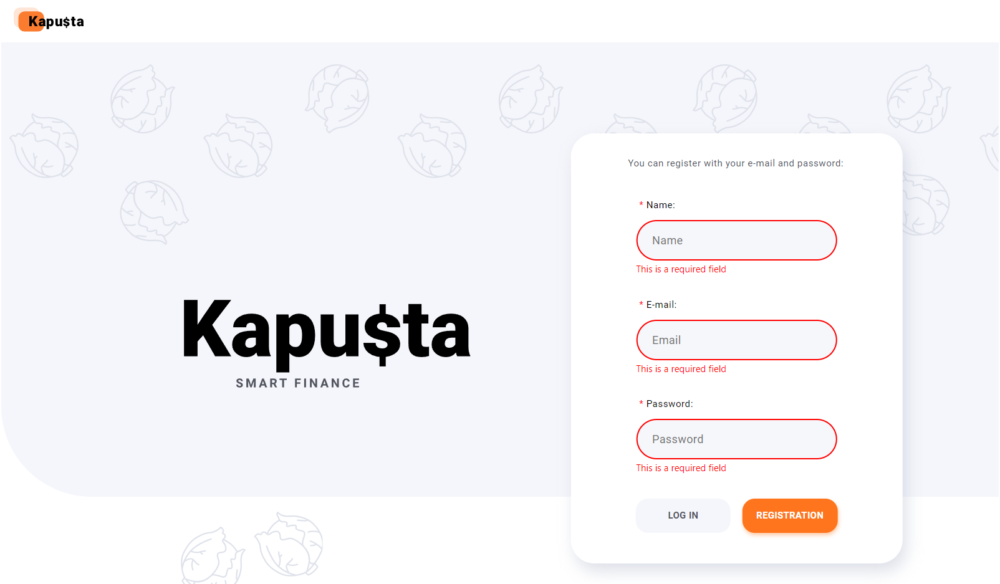
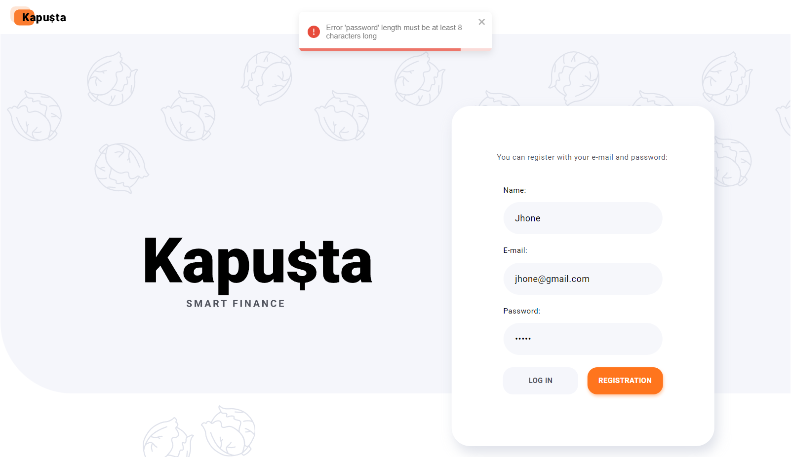
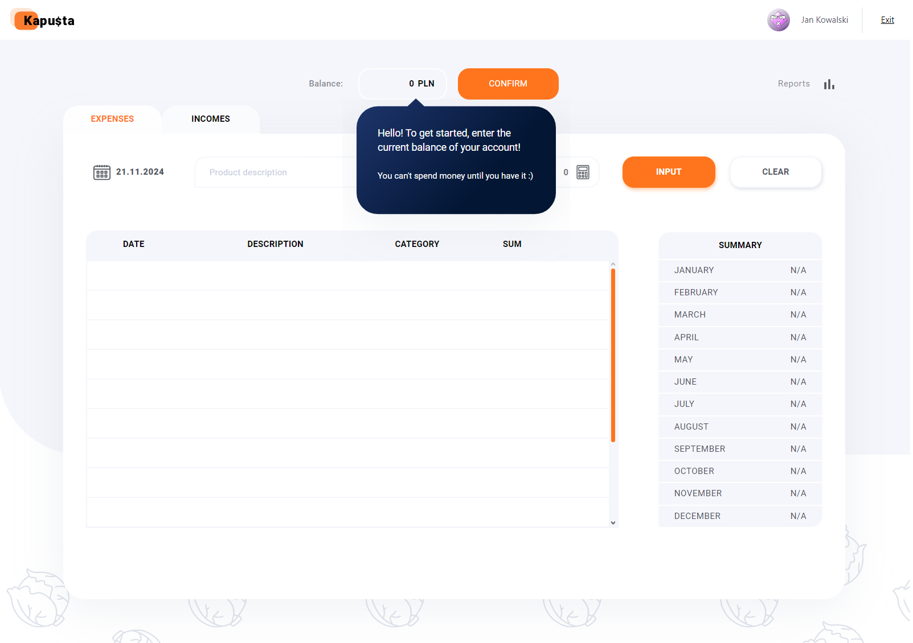
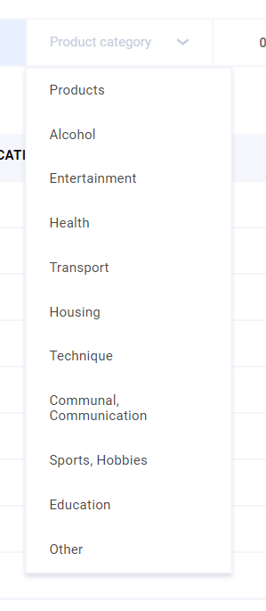
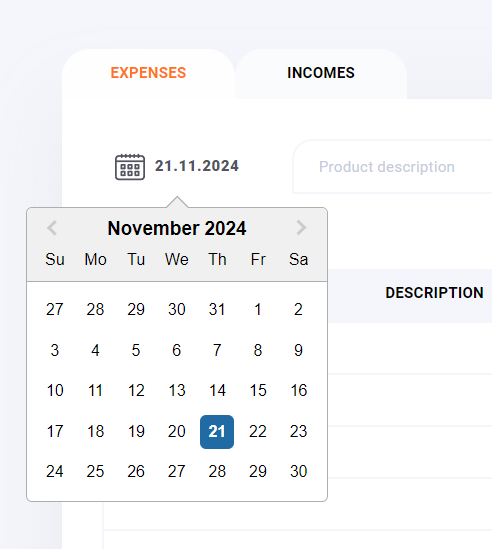
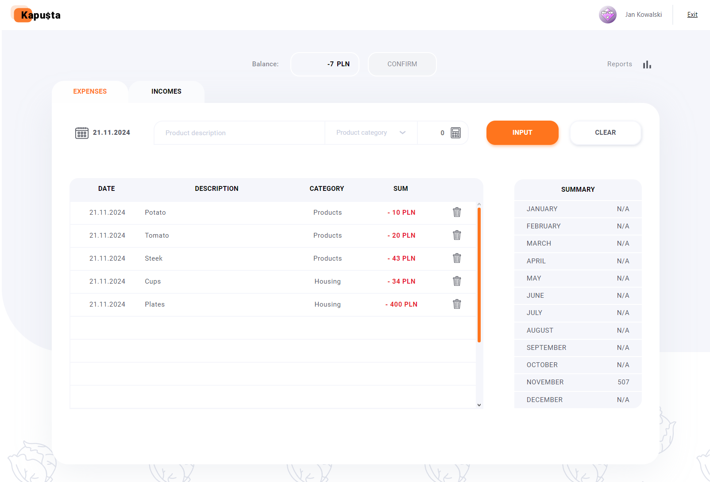
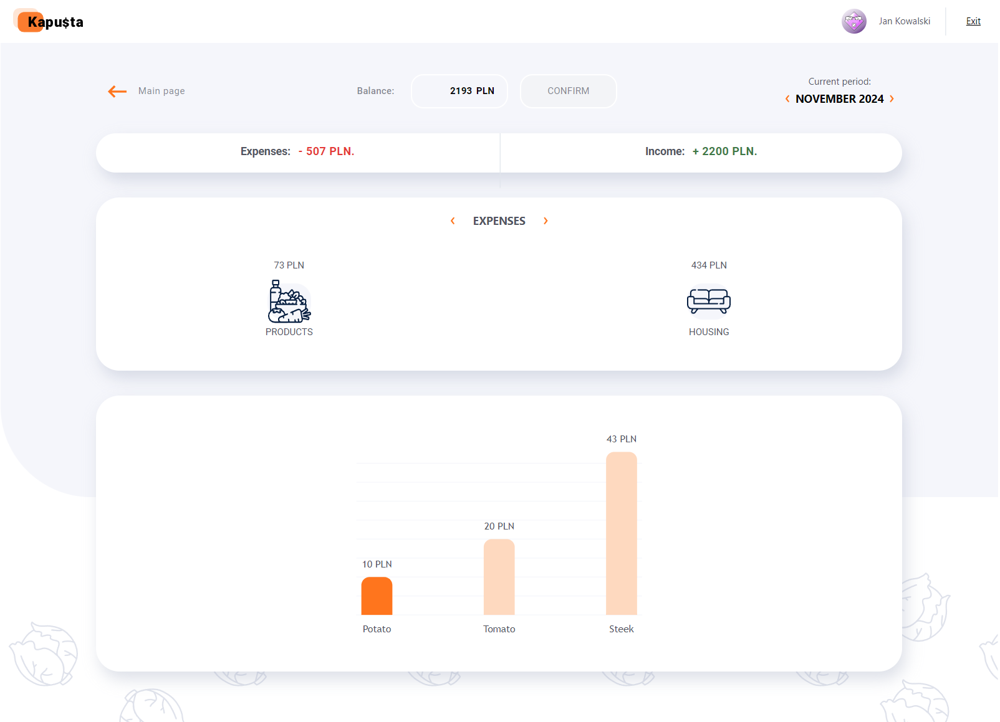

# Project-Kapusta 🥬

Aplikacja stworzona do zarządzania finansami osobistymi. Umożliwia monitorowanie wydatków,
przychodów oraz wizualizację danych w przejrzysty i interaktywny sposób.

## Technologie

- **Frontend**: React, Victory (biblioteka do wizualizacji danych).
- **Backend**: Node.js, Express, Mongoose.
- **Baza danych**: MongoDB.

## Funkcjonalności

- Dodawanie, edytowanie i usuwanie wydatków/przychodów.
- Generowanie wizualizacji danych finansowych.
- REST API umożliwiające operacje CRUD.

## API Dokumentacja

Pełna dokumentacja dostępna jest w pliku Swagger UI (lub link):  
https://project-kapusta-rest-api.vercel.app/api-docs/

## Backend

Backend aplikacji znajduje się na platformie hostingowej Vercel.

## Zrzuty ekranu

